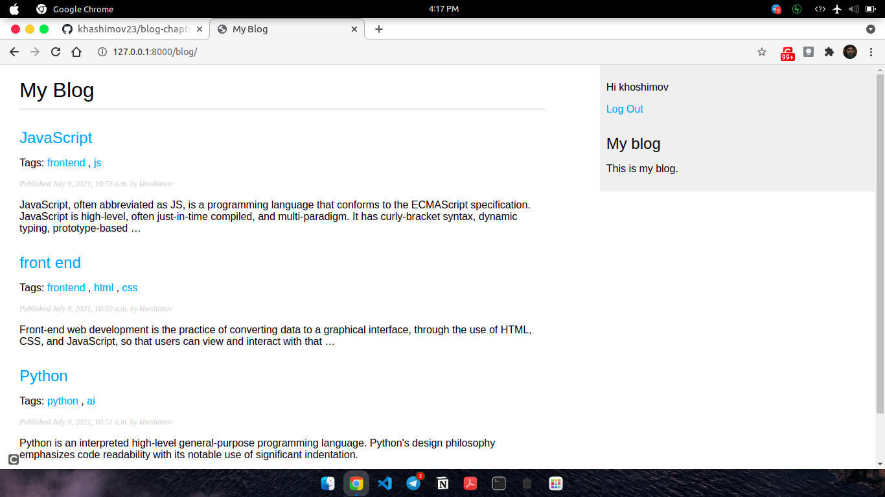
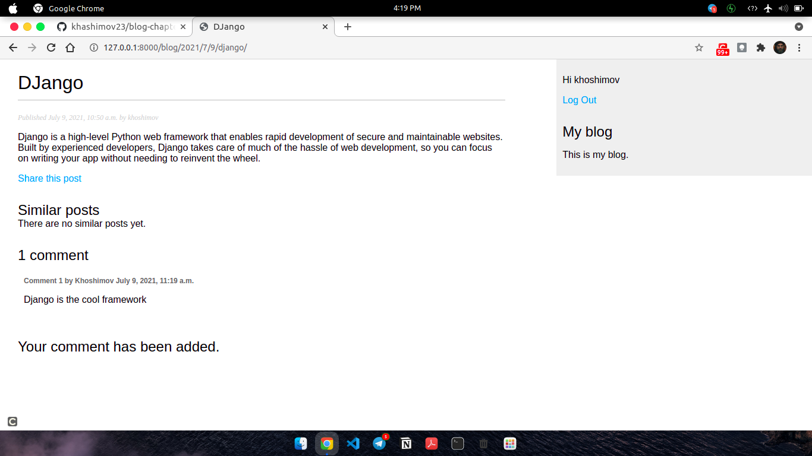
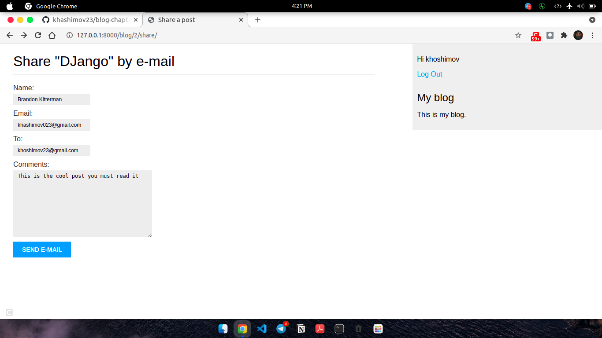

## Django 3
### Blog Application with tagging system, commenting feature, sharing posts via e-mail, recommending similar posts with custom search engine, and own text editor.

Steps:
### Building Web Blog Application (Done)✅
- Installing Django
- Creating and configuring a Django project
- Creating a Django application
- Designing models and generating model migrations
- Creating an administration site for your models
- Working with QuerySets and managers
- Building views, templates, and URLs
- Adding pagination to list views
- Using Django's class-based views

### Enhancing Your Blog with Advanced Features  (Done)✅
- Sending emails with Django
- Creating forms and handling them in views
- Creating forms from models
- Integrating third-party applications
- Building complex QuerySets

## main page

## detail page

## share post

